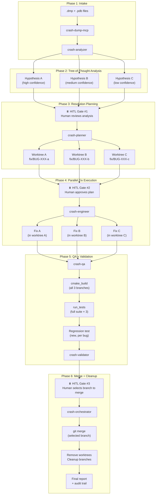
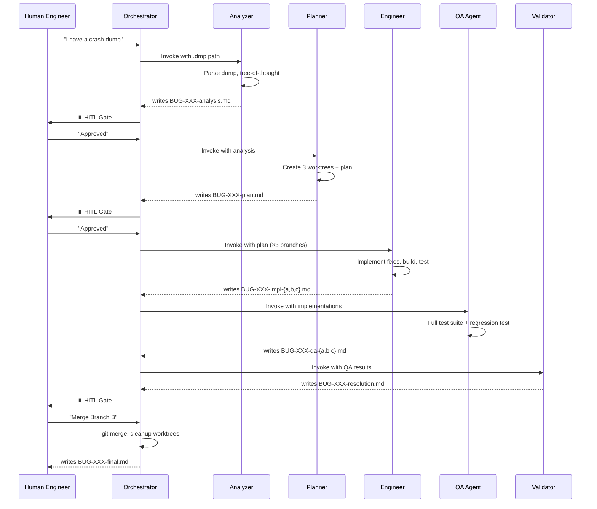
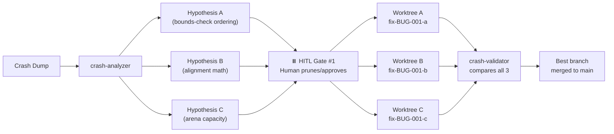

# AI Agent Crash Dump SDLC — Workshop Guide

> **Duration:** 3–4 hours · **Level:** Advanced · **Plan tier:** Business/Enterprise
> **Audience:** Instructor-led workshop for C++ game engine developers
> **Prerequisites:** VS Code + GitHub Copilot (Business/Enterprise), local debug build of this repo, Windows Debugging Tools (for live demo)
>
> **Knowledge files:** [architect.md](docs/architect.md), [cplusplus-knowledge.md](docs/cplusplus-knowledge.md)

---

## Table of Contents

1. [AI Agent Crash Dump SDLC Demonstration](#1-ai-agent-crash-dump-sdlc-demonstration) (~40 min)
2. [The CORE Framework](#2-the-core-framework) (~20 min)
3. [Overall SDLC Walkthrough](#3-overall-sdlc-walkthrough) (~25 min)
4. [Context Foundation](#4-context-foundation) (~30 min)
5. [Copilot AI Agents](#5-copilot-ai-agents) (~35 min)
6. [Tree of Thought](#6-tree-of-thought) (~20 min)
7. [WorkTree](#7-worktree) (~20 min)
8. [Human-in-the-Loop](#8-human-in-the-loop) (~30 min)

---

## 1. AI Agent Crash Dump SDLC Demonstration (~40 min)

### What This Is

The AI Agent Crash Dump SDLC is a **fully automated, multi-agent pipeline** that takes a raw crash dump (`.dmp` file) and produces a tested, reviewed, merged fix — all orchestrated by GitHub Copilot custom AI agents with human engineers making critical decisions at defined gates.

**The traditional workflow** (manual):

- Developer receives crash dump → opens WinDbg → spends 30–90 minutes reading stack frames → forms one hypothesis → implements fix → hopes it works → iterates if wrong

**The agentic workflow** (this SDLC):

- Engineer feeds dump to orchestrator → 6 specialized agents collaborate → 3 hypotheses explored in parallel → best fix validated automatically → human approves at 3 gates → merged in <15 minutes for routine bugs

### Architecture Diagram



### The 6 Agent Roles

| Agent                  | Purpose                                                      | Output Artifact           |
| ---------------------- | ------------------------------------------------------------ | ------------------------- |
| **crash-analyzer**     | Parse dumps, extract stacks, produce 3 root-cause hypotheses | `BUG-XXX-analysis.md`     |
| **crash-planner**      | Convert hypotheses into fix strategies + create worktrees    | `BUG-XXX-plan.md`         |
| **crash-engineer**     | Implement minimum viable fixes in isolated branches          | `BUG-XXX-impl-{a,b,c}.md` |
| **crash-qa**           | Run full test suite + generate regression tests              | `BUG-XXX-qa-{a,b,c}.md`   |
| **crash-validator**    | Score branches, recommend best fix                           | `BUG-XXX-resolution.md`   |
| **crash-orchestrator** | Conduct pipeline, enforce HITL gates, merge                  | `BUG-XXX-final.md`        |

### Live Demonstration: BUG-001 (Heap Corruption in Arena Allocator)

#### The Bug

`BUG-001` is a **heap-corruption crash** in the arena allocator. The bounds check runs _after_ the offset advances, so alignment padding can push the allocation past the buffer tail. The third 40-byte allocation at 32-byte alignment triggers a SIGSEGV/access violation when writing past the arena.

**Files involved:**

- `fixtures/crash_dumps/BUG-001/repro.cpp` — minimal reproducer
- `src/engine_demo/allocator.cpp` — buggy implementation
- `include/engine_demo/allocator.h` — allocator interface
- `tests/engine_demo/test_allocator.cpp` — contains `DISABLED_third_aligned_alloc_does_not_overrun_arena`

#### Step-by-Step Demo (10 Steps)

---

**Step 1: Intake — Load the Crash Dump**

> **Instructor action:** Switch to the `crash-orchestrator` agent. Provide the dump.

```text
I have a crash dump at fixtures/crash_dumps/BUG-001/BUG-001.dmp with symbols at
fixtures/crash_dumps/BUG-001/. Bug ID is BUG-001.
```

**What happens:** The `crash-dump-mcp` server opens the `.dmp` via `cdb.exe`, verifies symbol match, extracts metadata (exception code `0xC0000005` ACCESS_VIOLATION).

---

**Step 2: Analysis — Tree-of-Thought Diagnosis**

> **Instructor action:** The orchestrator delegates to `crash-analyzer`.

The analyzer uses the `tree-of-thought-analysis.prompt.md` framework to produce 3 hypotheses:

| Hypothesis | Confidence | Root Cause                                                                    |
| ---------- | ---------- | ----------------------------------------------------------------------------- |
| A          | High       | Bounds check ordering: `m_offset` advances before validation against capacity |
| B          | Medium     | Alignment calculation: `align_up()` produces incorrect offset for edge cases  |
| C          | Low        | Arena capacity: buffer is too small for 3 aligned allocations                 |

**Output:** `docs/crash-reports/BUG-001-analysis.md`

---

**Step 3: HITL Gate #1 — Human Reviews Analysis**

The orchestrator presents:

```markdown
### ⏸️ HUMAN IN THE LOOP — Decision Required

**Context**: Tree-of-thought analysis complete. 3 hypotheses generated.

**Options**:

1. ✅ **APPROVE** — proceed to planning with all 3 hypotheses
2. ❌ **REJECT** — analysis is fundamentally wrong
3. 🔄 **REVISE** — adjust specific hypotheses

**Awaiting response.**
```

> **Instructor says:** "I'll APPROVE. Hypothesis A looks correct — the bounds check ordering is indeed the issue. But let's let all 3 branches run to demonstrate the parallel approach."

---

**Step 4: Planning — Design 3 Fix Strategies**

The `crash-planner` creates 3 worktrees and defines strategies:

| Branch          | Strategy       | Approach                                                      |
| --------------- | -------------- | ------------------------------------------------------------- |
| `fix/BUG-001-a` | `bounds-check` | Move bounds check before `m_offset` mutation                  |
| `fix/BUG-001-b` | `ordering-fix` | Compute aligned offset + end in locals, validate, then commit |
| `fix/BUG-001-c` | `type-fix`     | Change capacity to account for max alignment overhead         |

**Output:** `docs/crash-reports/BUG-001-plan.md` + 3 git worktrees

---

**Step 5: HITL Gate #2 — Human Approves Plan**

> **Instructor says:** "I'll APPROVE. All 3 approaches are reasonable. Branch B is the cleanest approach but let's see what the engineer produces for each."

---

**Step 6: Implementation — Fix in Parallel Worktrees**

The `crash-engineer` implements minimum viable fixes in each worktree:

**Branch A example** (the simplest fix):

```cpp
// BEFORE (buggy): offset advances, THEN bounds check
void* allocator::allocate(std::size_t n, std::size_t alignment) noexcept
{
    m_offset = align_up(m_offset, alignment);  // ← advances past tail!
    const auto end = m_offset + n;
    if (end > m_capacity) return nullptr;      // ← too late
    // ...
}

// AFTER (fixed): bounds check FIRST using local variables
void* allocator::allocate(std::size_t n, std::size_t alignment) noexcept
{
    const auto aligned = align_up(m_offset, alignment);
    const auto end = aligned + n;
    if (end > m_capacity) return nullptr;      // ← safe
    m_offset = end;                            // ← only commit if valid
    // ...
}
```

Each branch must: compile with ZERO errors, maintain test pass rate, follow Constitution (no exceptions, EASTL-only, allocator-aware).

**Output:** `docs/crash-reports/BUG-001-impl-{a,b,c}.md`

---

**Step 7: QA — Test All Branches**

The `crash-qa` agent runs for each branch:

1. Full test suite (`ctest --preset default-debug`)
2. Generates a regression test: `DISABLED_third_aligned_alloc_does_not_overrun_arena` → re-enabled
3. Verifies: regression test FAILS on unfixed base, PASSES on fixed branch

**Output:** `docs/crash-reports/BUG-001-qa-{a,b,c}.md`

---

**Step 8: Validation — Branch Comparison**

The `crash-validator` scores each branch:

| Criteria (weight)             | Branch A  | Branch B  | Branch C     |
| ----------------------------- | --------- | --------- | ------------ |
| Correctness (40%)             | ✅ Passes | ✅ Passes | ⚠️ Masks bug |
| Test health (30%)             | 100% pass | 100% pass | 100% pass    |
| Minimal change (20%)          | 3 lines   | 5 lines   | 1 line       |
| Constitution compliance (10%) | ✅ Full   | ✅ Full   | ✅ Full      |
| **Score**                     | **92**    | **95**    | **68**       |

**Recommendation:** Branch B — clearest expression of intent, computes in locals then commits.

**Output:** `docs/crash-reports/BUG-001-resolution.md`

---

**Step 9: HITL Gate #3 — Human Selects Branch**

> **Instructor says:** "I'll MERGE Branch B. The local-variable pattern is the canonical safe approach and most readable."

---

**Step 10: Merge + Cleanup**

The orchestrator:

1. Merges `fix/BUG-001-b` into `main`
2. Removes all 3 worktrees
3. Deletes orphaned branches
4. Writes final audit trail with timeline, decisions, commit SHA

**Output:** `docs/crash-reports/BUG-001-final.md`

---

### Agentic Pipeline Prompts vs. Manual Triage Prompts

> **Important distinction:** The crash-dump SDLC uses two different prompt workflows depending on context:

**Agentic Pipeline** (multi-agent, orchestrator-driven — this SDLC):

- Prompts live in `.github/prompts/` (e.g., `crash-dump-intake.prompt.md`, `tree-of-thought-analysis.prompt.md`)
- Invoked by agent workflows automatically
- Multi-step, artifact-producing, HITL-gated

**Manual Triage** (single-agent, facilitator-led — Session 02 classroom demo):

- Prompts are typed by the facilitator in Plan Mode / Edit Mode
- Used for 10-minute classroom exercises
- Single-step, conversational, no orchestration

The manual triage prompts from the Session 02 facilitator script:

```text
# Plan Mode — Pinpoint:
#file:fixtures/crash_dumps/BUG-001/repro.cpp
#file:include/engine_demo/allocator.h
#file:src/engine_demo/allocator.cpp
A debugger reports a heap-corruption fault inside the third call to allocator::allocate.
Identify the call stack frame most likely responsible for the corruption. Cite the line.

# Plan Mode — Root Cause:
#file:src/engine_demo/allocator.cpp
List every line that mutates m_offset, in source order. For each, state the precondition
that must hold for the mutation to be safe.

# Agent Mode — Fix with Test:
#file:src/engine_demo/allocator.cpp
#file:tests/engine_demo/test_allocator.cpp
Refactor allocate() so the bounds check happens BEFORE m_offset is mutated. Re-enable the
DISABLED_third_aligned_alloc_does_not_overrun_arena test. Constitutional articles 1, 2 hold.
```

These manual prompts demonstrate the same principles as the agentic pipeline (context belts, Plan→Edit mode transition, constitutional compliance) but in a simplified, non-orchestrated form.

---

## 2. The CORE Framework (~20 min)

### 2.1 What is CORE?

**CORE** is a structured, four-part methodology for engineering high-quality AI agent interactions. It transforms vague requests into precise, repeatable instructions that produce consistent results.

| Pillar           | Definition                                      | Question It Answers                   |
| ---------------- | ----------------------------------------------- | ------------------------------------- |
| **C** — Context  | Background knowledge, role, domain constraints  | "What does the AI need to know?"      |
| **O** — Output   | Expected artifact format, location, structure   | "What exactly should the AI produce?" |
| **R** — Rules    | Constraints, forbidden actions, non-negotiables | "What must the AI never do?"          |
| **E** — Examples | Exemplar outputs, self-test criteria, templates | "What does 'good' look like?"         |

### 2.2 Why CORE?

Without CORE, prompts are fragile — they work sometimes, fail unpredictably, and produce inconsistent output. With CORE, every interaction is **reproducible, auditable, and testable**.

| Without CORE                            | With CORE                                                               |
| --------------------------------------- | ----------------------------------------------------------------------- |
| "Fix this crash" → generic advice       | Context grounds the AI in the specific allocator code                   |
| Output is wherever AI decides to put it | Output contract specifies `docs/crash-reports/BUG-XXX-analysis.md`      |
| AI might suggest `try/catch`            | Rules forbid exceptions per Constitution Article 1                      |
| No way to verify correctness            | Examples provide self-test criteria (regression test must fail on base) |

### 2.3 CORE Applied at Two Levels

CORE operates at both **macro** (full pipeline design) and **micro** (individual file authoring) levels:

**Macro level** — the entire SDLC pipeline:

- **Context**: The `.github/instructions/` files, `copilot-instructions.md`, `specs/constitution.md`
- **Output**: The artifact chain (`analysis.md` → `plan.md` → `impl.md` → `qa.md` → `resolution.md` → `final.md`)
- **Rules**: Constitution articles, HITL gates, MVF principle, no std:: containers
- **Examples**: `fixtures/crash_dumps/BUG-001/` as the reference scenario, DISABLED\_ tests as success criteria

**Micro level** — each individual file:

- Every `.agent.md` IS a CORE document (see Section 5.2)
- Every `.prompt.md` IS a CORE document
- Every `.instructions.md` IS a CORE document

### 2.4 CORE Mapping to Copilot Customization Files

| File Type          | C (Context)                              | O (Output)                      | R (Rules)                                | E (Examples)                           |
| ------------------ | ---------------------------------------- | ------------------------------- | ---------------------------------------- | -------------------------------------- |
| `.agent.md`        | `## Role` + `description:`               | `## Output` (artifact path)     | `tools:` allowlist + `## Constraints`    | `## Self-test`                         |
| `.instructions.md` | `description:` + `applyTo:`              | (implicit: shapes agent output) | The rules themselves                     | Reference tables, templates            |
| `.prompt.md`       | `## Context references` + `#file:` links | `## Output contract`            | `## Pre-conditions` + forbidden patterns | `## Self-validation` + expected format |
| `constitution.md`  | (implicit: this IS context)              | (implicit: shapes all outputs)  | Articles 1–8                             | Violation examples                     |

### 2.5 Building Agents Using CORE (Step by Step)

When creating a new agent, follow CORE order:

1. **Context first** — Define the role. What does this agent know? What domain is it operating in? What files/knowledge does it need?

2. **Output second** — Define the artifact. What exact file does it produce? What format? Where does it live? Who consumes it?

3. **Rules third** — Define the constraints. What tools is it allowed to use? What is forbidden? What constitutional articles apply?

4. **Examples last** — Define the self-test. How do you know the output is correct? What does a good artifact look like? What must be true before declaring done?

> **Key insight:** Most engineers instinctively start with Rules ("don't do X, don't do Y"). CORE says start with Context — if the AI has the right context, it's less likely to need explicit prohibition. Rules are the safety net, not the primary guidance.

---

## 3. Overall SDLC Walkthrough (~25 min)

### Project Structure

```
crash-dump-sdlc-workshop/
├── .github/
│   ├── copilot-instructions.md          ← Workspace-wide Copilot rules
│   ├── agents/                          ← 6 custom AI agent definitions
│   │   ├── crash-analyzer.agent.md
│   │   ├── crash-planner.agent.md
│   │   ├── crash-engineer.agent.md
│   │   ├── crash-qa.agent.md
│   │   ├── crash-validator.agent.md
│   │   └── crash-orchestrator.agent.md
│   ├── instructions/                    ← 3 scoped instruction files
│   │   ├── crash-dump-analysis.instructions.md
│   │   ├── crash-fix-engineering.instructions.md
│   │   └── resolution-tracking.instructions.md
│   └── prompts/                         ← 6 reusable prompt templates
│       ├── crash-dump-intake.prompt.md
│       ├── tree-of-thought-analysis.prompt.md
│       ├── resolution-brief.prompt.md
│       ├── regression-test-generation.prompt.md
│       ├── fix-validation.prompt.md
│       └── resolution-report.prompt.md
├── .vscode/
│   └── mcp.json                         ← MCP server registration
├── tools/
│   ├── crash-dump-mcp/                  ← MCP server: 7 debugger tools (cdb.exe wrapper)
│   └── worktree-mcp/                    ← MCP server: 6 git/build/test tools
├── specs/
│   └── constitution.md                  ← Ground truth: 8 non-negotiable articles
├── src/engine_demo/                     ← C++ game engine library (with seeded bugs)
├── include/engine_demo/                 ← Public headers
├── tests/engine_demo/                   ← GoogleTest suite (DISABLED_ tests = seeded bugs)
├── fixtures/
│   ├── crash_dumps/BUG-001/             ← Crash dump + reproducer for Session 02
│   ├── bug-reports/                     ← 5 seeded bugs (BUG-002 through BUG-006)
│   └── seeded-bugs.md                   ← Bug catalog
├── docs/
│   └── crash-reports/                   ← Agent output artifacts land here
└── AGENTS.md                            ← Hard rules for any agent in this workspace
```

### MCP Server Registration (`.vscode/mcp.json`)

This file tells VS Code how to start and connect to the two MCP servers:

```json
{
  "servers": {
    "crash-dump-mcp": {
      "type": "stdio",
      "command": "node",
      "args": ["tools/crash-dump-mcp/dist/index.js"],
      "env": {
        "CDB_PATH": "${input:cdbPath}",
        "SYMBOL_PATH": "fixtures/crash_dumps"
      }
    },
    "worktree-mcp": {
      "type": "stdio",
      "command": "node",
      "args": ["tools/worktree-mcp/dist/index.js"],
      "env": {
        "WORKTREE_BASE": ".worktrees",
        "CMAKE_PRESET": "default-debug"
      }
    }
  },
  "inputs": [
    {
      "id": "cdbPath",
      "type": "promptString",
      "description": "Path to cdb.exe (Windows Debugging Tools)",
      "default": "C:/Program Files (x86)/Windows Kits/10/Debuggers/x64/cdb.exe"
    }
  ]
}
```

**Key points:**

- `type: "stdio"` — communicates over stdin/stdout (standard MCP transport)
- `${input:cdbPath}` — prompts the user on first use (no secrets in committed files)
- Servers auto-start when VS Code opens the workspace
- Agents reference tools as `crash-dump-mcp/*` or `worktree-mcp/*` in their `tools:` field

### Folder Purpose Summary

| Folder                  | Purpose                                                                  | Who Uses It                                |
| ----------------------- | ------------------------------------------------------------------------ | ------------------------------------------ |
| `.github/agents/`       | Define 6 specialized AI agents with roles, tools, and workflows          | Copilot (auto-loads when agent invoked)    |
| `.github/instructions/` | Inject scoped rules based on file patterns being worked on               | Copilot (auto-activates via `applyTo`)     |
| `.github/prompts/`      | Reusable prompt templates with `$VARIABLE` placeholders                  | Agents (invoke as workflow steps)          |
| `.vscode/mcp.json`      | Register MCP servers for auto-start in VS Code                           | VS Code (starts servers on workspace open) |
| `tools/crash-dump-mcp/` | Wrap `cdb.exe` debugger as 7 MCP tools                                   | crash-analyzer agent                       |
| `tools/worktree-mcp/`   | Wrap git worktree + cmake + ctest as 6 MCP tools                         | crash-planner, engineer, qa agents         |
| `specs/constitution.md` | 8 non-negotiable C++ coding articles                                     | All agents (ground truth)                  |
| `docs/crash-reports/`   | Artifact output directory (analysis, plans, impl, qa, resolution, final) | All agents (write), humans (read/review)   |
| `fixtures/crash_dumps/` | Pre-captured crash dumps with reproducers for training                   | crash-analyzer (input)                     |
| `tests/engine_demo/`    | GoogleTest suite — `DISABLED_` prefix = seeded bug                       | crash-qa (re-enables after fix)            |

### Copilot AI Capabilities Inventory

| Capability                      | Where Used                   | CORE Pillar                               |
| ------------------------------- | ---------------------------- | ----------------------------------------- |
| Custom AI Agents (`.agent.md`)  | 6 agents collaborate         | Full CORE (each agent is a CORE document) |
| MCP Servers                     | crash-dump-mcp, worktree-mcp | Rules (tool boundaries)                   |
| Tree-of-Thought                 | 3 hypotheses per analysis    | Output (structured multi-hypothesis)      |
| Context Belts (`#file:` refs)   | Prompts ground AI in source  | Context                                   |
| Plan Mode → Edit Mode           | Analysis → Implementation    | Rules (read-only before write)            |
| HITL Gates                      | 3 pause points               | Rules (non-negotiable per Article 8)      |
| Git Worktrees                   | 3 parallel fix branches      | Output (isolated implementations)         |
| Prompt Templates (`.prompt.md`) | 6 reusable workflows         | Full CORE                                 |
| Instruction Scoping (`applyTo`) | Auto-activate rules          | Context + Rules                           |
| Custom Instructions             | Workspace-wide constraints   | Rules                                     |

---

## 4. Context Foundation (~30 min)

> **Goal of this section:** Understand the pre-built context engineering that makes the AI agents operate at expert level. Without this foundation, Copilot would produce generic C++ advice. With it, Copilot produces game-engine-specific, constitution-compliant, crash-dump-aware analysis.
>
> **CORE mapping:** This entire section is about building the **Context** pillar — the knowledge agents need to operate at expert level.

### 4.1 Custom Instructions (`copilot-instructions.md`)

**Location:** `.github/copilot-instructions.md`

This file applies to **every** Copilot interaction in the workspace. It establishes:

```markdown
# Workspace-wide rules (always active)

- EASTL-only containers (never std::)
- Compile with -fno-exceptions -fno-rtti
- Every container needs explicit allocator parameter
- [[nodiscard]] on factories and status-returning functions
- Move ops must be noexcept
- Use double for simulation; std::mt19937 for RNG (explicitly seeded, interop boundary)
- Ground truth: specs/constitution.md
```

**Why this matters (CORE Context):** Every agent response will respect these constraints without needing to be reminded. The crash-engineer can't accidentally introduce `std::vector` or throw an exception.

### 4.2 Scoped Instruction Files (`.github/instructions/`)

These files auto-activate based on `applyTo` glob patterns:

#### `crash-dump-analysis.instructions.md`

- **Activates on:** `docs/crash-reports/**-analysis.md`
- **CORE role:** Context + Rules for the crash-analyzer agent
- **Contains:**
  - MCP tool usage sequence: `parse_minidump` → `get_call_stack` → `analyze_crash` → `resolve_symbols` → `get_memory_region`
  - Exception code reference table (`0xC0000005` = ACCESS_VIOLATION, `0xC0000374` = HEAP_CORRUPTION, etc.)
  - Evidence standards (stack frames with source+line, memory dumps ≥64 bytes around fault, register state)
  - Tree-of-thought structure requirements (exactly 3 hypotheses, at least one "high" confidence)

#### `crash-fix-engineering.instructions.md`

- **Activates on:** `docs/crash-reports/**-impl-*.md`
- **CORE role:** Rules for the crash-engineer agent
- **Contains:**
  - Worktree layout conventions (`.worktrees/fix-BUG-XXX-{a,b,c}/`)
  - C++ constraints (Constitution compliance checklist)
  - Minimum Viable Fix principle ("fix the crash, nothing else")
  - Build validation protocol (zero errors, maintain/improve test pass rate)

#### `resolution-tracking.instructions.md`

- **Activates on:** `docs/crash-reports/**`
- **CORE role:** Output + Rules for all agents
- **Contains:**
  - File naming convention (`BUG-NNN-{analysis|plan|impl|qa|resolution|final}.md`)
  - HITL gate markdown format (exact template)
  - Artifact lifecycle (immutability rules — analysis is immutable after plan creation)
  - Audit trail requirements (timeline, decisions, branch selected, commit SHA)

**Key insight:** These instructions are _invisible_ to the user but _always present_ when an agent works on matching files. This is how you encode institutional knowledge into AI workflows — it's the **Context** pillar applied automatically via file pattern matching.

### 4.3 Pre-Built Knowledge Files

#### `specs/constitution.md` — The Ground Truth

8 non-negotiable articles that every code artifact must respect:

| Article | Rule                                                                         | Enforcement                |
| ------- | ---------------------------------------------------------------------------- | -------------------------- |
| 1       | No exceptions (`-fno-exceptions` / `/EHs-c-`)                                | Compiler flag + clang-tidy |
| 2       | No RTTI (`-fno-rtti` / `/GR-`)                                               | Compiler flag + clang-tidy |
| 3       | EASTL-first (no `std::` containers in committed code)                        | clang-tidy + code review   |
| 4       | Allocator-aware (explicit allocator at every container construction)         | Code review                |
| 5       | Determinism (explicit seeds, `double` accumulators, deterministic iteration) | Test verification          |
| 6       | Real-time budgets (≤16.67ms at 60 FPS, no inner-loop allocation)             | Profiler + review          |
| 7       | Test-first (every public function has ≥1 GTest, test written before impl)    | CI gate                    |
| 8       | HITL gates (pause between plan→tasks, between each implement task)           | Agent enforcement          |

> **Note on Article 8:** Articles 1–7 are C++ coding rules enforced at compile/test time. Article 8 is a pipeline-level rule enforced by the orchestrator agent. Both are non-negotiable, but they operate at different levels.

**CORE role:** The constitution is simultaneously **Context** (agents internalize it) and **Rules** (agents must not violate it).

#### `AGENTS.md` — Agent Operating Rules

Restates the hard constraints specifically for AI agents operating in this workspace. This is the first file any agent reads.

#### `fixtures/crash_dumps/BUG-001/` — Crash Context

Documents the crash dump conditions:

- 160-byte arena with guard page
- 3 aligned allocations of 40 bytes at 32-byte alignment
- Third allocation overruns because offset advances before bounds check
- Expected exception: ACCESS_VIOLATION at guard page

### 4.4 Prompt Templates (`.github/prompts/`)

These are parameterized workflows that agents invoke:

| Template                               | Variables                            | CORE Role                 |
| -------------------------------------- | ------------------------------------ | ------------------------- |
| `crash-dump-intake.prompt.md`          | `$DUMP_PATH`, `$PDB_PATH`, `$BUG_ID` | Context + Output          |
| `tree-of-thought-analysis.prompt.md`   | (uses context from intake)           | Output + Rules + Examples |
| `resolution-brief.prompt.md`           | (uses analysis output)               | Output                    |
| `regression-test-generation.prompt.md` | `$BUG_ID`, context from impl         | Output + Rules            |
| `fix-validation.prompt.md`             | (uses QA output)                     | Rules + Examples          |
| `resolution-report.prompt.md`          | (uses all artifacts)                 | Output                    |

### 4.5 What is Context Engineering?

All of the above — instructions, scoped rules, knowledge files, prompt templates — form a practice called **context engineering**. The principle:

> **AI performance is bounded by the quality of context it receives.** Pre-loading domain knowledge, constraints, patterns, and decision frameworks transforms a generic AI into a domain expert.

Without context engineering, Copilot analyzing a crash dump might suggest:

- "Check if the pointer is null" (generic)
- "Add a try-catch block" (violates Article 1)
- "Use std::vector" (violates Article 3)

With context engineering, Copilot produces:

- "The bounds check at line 47 of allocator.cpp occurs after m_offset mutation" (specific)
- "Return nullptr on overflow per the noexcept contract" (constitution-compliant)
- "The aligned offset exceeds m_capacity by 24 bytes at the third call" (evidence-based)

**In CORE terms:** Context engineering is the discipline of building the **C** pillar systematically, so the **O**, **R**, and **E** pillars produce correct outputs.

---

## 5. Copilot AI Agents (~35 min)

### 5.1 What is a GitHub Copilot Custom AI Agent?

A **custom AI agent** is a specialized Copilot assistant defined in a `.agent.md` file inside `.github/agents/`. Each agent has:

- **A specific role** — one job, done well
- **Allowed tools** — which MCP tools and built-in capabilities it can use
- **A workflow** — step-by-step instructions for how to approach its task
- **An output artifact** — a specific file it produces
- **Handoff rules** — what happens after it's done (next agent or HITL gate)

Agents are invoked by name in Copilot Chat (e.g., `@crash-analyzer`) or delegated to by the orchestrator agent via `handoffs:`.

> **Discovery:** VS Code automatically discovers `.agent.md` files in `.github/agents/` and makes them available as chat participants. No registration step needed.

### 5.2 Agent Format as CORE (Anatomy of `.agent.md`)

Every `.agent.md` file IS a CORE document. Here's the mapping:

```yaml
---
description: One-line purpose of this agent                    # ← CORE: Context (brief)
model: "Claude Sonnet 4.6 (copilot)"                          # ← Runtime config
tools:                                                         # ← CORE: Rules (tool boundary)
  - crash-dump-mcp/*
  - read_file
  - semantic_search
  - grep_search
handoffs:                                                      # ← CORE: Output (delegation)
  - agent: crash-orchestrator
    label: "Return to orchestrator"
    prompt: "Analysis complete. Present HITL Gate #1."
---

# crash-analyzer                                               # ← Agent name

## Role                                                        # ← CORE: Context
Parse minidumps using the crash-dump-mcp tools. Extract symbolicated call stacks.
Produce a tree-of-thought analysis with exactly 3 root-cause hypotheses.

## When to Use                                                 # ← CORE: Context
Invoked by crash-orchestrator after intake. Activated when a .dmp file
path is provided and symbols are available.

## Workflow                                                     # ← CORE: Output (process)
1. Call parse_minidump with the dump and symbol paths
2. Call get_call_stack for the faulting thread
3. Call resolve_symbols for the faulting address
4. Correlate with source using read_file
5. Generate 3 hypotheses using tree-of-thought framework
6. Write analysis to docs/crash-reports/<BUG-ID>-analysis.md
7. Hand off to orchestrator for HITL Gate #1

## Output                                                      # ← CORE: Output (artifact)
`docs/crash-reports/<BUG-ID>-analysis.md`

## Constraints                                                 # ← CORE: Rules
- Exactly 3 hypotheses, each genuinely different
- At least one hypothesis must be "high" confidence
- Every hypothesis must cite specific file + line
- Never suggest fixes — analysis only
- Never violate Constitution articles in reasoning

## Self-test                                                   # ← CORE: Examples
- [ ] Output file exists at correct path
- [ ] Contains exactly 3 hypotheses with confidence levels
- [ ] Each hypothesis answers the 5 questions (what/why/when/where/confidence)
- [ ] Anti-patterns avoided (no same-bug-3-ways, no vague pointers)
- [ ] File/line citations are valid (reference real source files)
```

> **CORE breakdown:**
>
> - **Context** = `description:` + `## Role` + `## When to Use` (what the agent knows, when it activates)
> - **Output** = `handoffs:` + `## Workflow` + `## Output` (what it produces, where, in what format)
> - **Rules** = `tools:` + `## Constraints` (what it can/cannot do)
> - **Examples** = `## Self-test` (what "done correctly" looks like)

### 5.3 Building an Agent Using CORE (Step by Step)

Follow CORE order when creating a new agent:

| Step | CORE Pillar  | Action                                                            | Key Question                                                             |
| ---- | ------------ | ----------------------------------------------------------------- | ------------------------------------------------------------------------ |
| 1    | **Context**  | Define role, domain, knowledge requirements                       | "What must this agent understand to do its job?"                         |
| 2    | **Output**   | Define artifact path, format, consumer                            | "What exact file does it produce, and who reads it next?"                |
| 3    | **Rules**    | Define tool allowlist, forbidden actions, constitutional articles | "What boundaries prevent this agent from causing harm?"                  |
| 4    | **Examples** | Define self-test checklist, exemplar output                       | "How do I verify the output is correct without reading it line by line?" |

**Principle:** An agent should be testable independently. If you can't verify its output using the Self-test checklist without running the whole pipeline, its boundaries are too blurry.

**Anti-pattern:** Starting with Rules ("don't do X, don't do Y"). If you find yourself writing more Rules than Context, the agent's role isn't well-defined enough. Add more Context first.

### 5.4 Walkthrough of the 6 Crash Dump SDLC Agents

#### Agent 1: `crash-analyzer`

| Property           | Value                                                                                      | CORE Pillar |
| ------------------ | ------------------------------------------------------------------------------------------ | ----------- |
| **Purpose**        | Parse minidumps, extract call stacks, produce tree-of-thought with 3 root-cause hypotheses | Context     |
| **Tools**          | `crash-dump-mcp/*`, `read_file`, `semantic_search`, `grep_search`                          | Rules       |
| **Output**         | `docs/crash-reports/<BUG-ID>-analysis.md`                                                  | Output      |
| **Handoff**        | To crash-orchestrator (HITL Gate #1)                                                       | Output      |
| **Key constraint** | Exactly 3 distinct hypotheses, at least one "high" confidence                              | Rules       |
| **Self-test**      | 5-question framework answered per hypothesis, anti-patterns absent                         | Examples    |

---

#### Agent 2: `crash-planner`

| Property           | Value                                                                                  | CORE Pillar |
| ------------------ | -------------------------------------------------------------------------------------- | ----------- |
| **Purpose**        | Convert approved hypotheses into 3 parallel fix strategies with worktrees              | Context     |
| **Tools**          | `read_file`, `semantic_search`, `grep_search`, `worktree-mcp/*`                        | Rules       |
| **Output**         | `docs/crash-reports/<BUG-ID>-plan.md` + 3 worktrees                                    | Output      |
| **Handoff**        | To crash-orchestrator (HITL Gate #2)                                                   | Output      |
| **Key constraint** | Each branch addresses a different root cause; acceptance criteria defined per branch   | Rules       |
| **Self-test**      | 3 worktrees exist, plan.md has strategy per branch, acceptance criteria are measurable | Examples    |

---

#### Agent 3: `crash-engineer`

| Property           | Value                                                                                            | CORE Pillar |
| ------------------ | ------------------------------------------------------------------------------------------------ | ----------- |
| **Purpose**        | Implement minimum viable fixes in isolated worktrees                                             | Context     |
| **Tools**          | `read_file`, `edit_file`, `create_file`, `worktree-mcp/*`, `run_in_terminal`                     | Rules       |
| **Output**         | `docs/crash-reports/<BUG-ID>-impl-{a,b,c}.md`                                                    | Output      |
| **Handoff**        | To crash-qa                                                                                      | Output      |
| **Key constraint** | No std::, no exceptions, no RTTI; zero build errors; maintain test pass rate                     | Rules       |
| **Self-test**      | `cmake_build` succeeds with 0 errors, existing tests still pass, Constitution checklist complete | Examples    |

**Minimum Viable Fix principle:** Fix the crash, nothing else. No refactoring, no features, no API changes.

---

#### Agent 4: `crash-qa`

| Property           | Value                                                                            | CORE Pillar |
| ------------------ | -------------------------------------------------------------------------------- | ----------- |
| **Purpose**        | Validate fixes via full test suite + regression test generation                  | Context     |
| **Tools**          | `read_file`, `worktree-mcp/*`, `create_file`, `edit_file`, `run_in_terminal`     | Rules       |
| **Output**         | `docs/crash-reports/<BUG-ID>-qa-{a,b,c}.md`                                      | Output      |
| **Handoff**        | To crash-validator                                                               | Output      |
| **Key constraint** | Regression test must FAIL on base branch, PASS on fixed branch                   | Rules       |
| **Self-test**      | Test fails on base (proves it catches the bug), passes on fix (proves fix works) | Examples    |

---

#### Agent 5: `crash-validator`

| Property            | Value                                                                             | CORE Pillar |
| ------------------- | --------------------------------------------------------------------------------- | ----------- |
| **Purpose**         | Synthesize all artifacts, score branches, recommend best fix                      | Context     |
| **Tools**           | `read_file`, `worktree-mcp/*`, `semantic_search`                                  | Rules       |
| **Output**          | `docs/crash-reports/<BUG-ID>-resolution.md`                                       | Output      |
| **Handoff**         | To crash-orchestrator (HITL Gate #3)                                              | Output      |
| **Scoring weights** | Correctness 40%, Test health 30%, Minimal change 20%, Constitution compliance 10% | Rules       |
| **Self-test**       | All 3 branches scored, recommendation justified, comparison table complete        | Examples    |

---

#### Agent 6: `crash-orchestrator`

| Property      | Value                                                                                 | CORE Pillar |
| ------------- | ------------------------------------------------------------------------------------- | ----------- |
| **Purpose**   | Conduct the entire pipeline, invoke agents, enforce HITL gates, merge approved branch | Context     |
| **Tools**     | All MCP tools + all built-in tools                                                    | Rules       |
| **Output**    | `docs/crash-reports/<BUG-ID>-final.md`                                                | Output      |
| **Key role**  | The only agent that can invoke other agents and enforce gate decisions                | Rules       |
| **Self-test** | All 6 artifacts exist, all 3 gates recorded, audit trail complete, worktrees cleaned  | Examples    |

### 5.5 Agent Collaboration Pattern



**Key design principle:** Agents communicate through **files**, not direct messages. Each agent reads the prior artifact and writes the next one. This creates an auditable trail and makes the system debuggable — you can inspect any artifact to understand what happened.

---

## 6. Tree of Thought (~20 min)

### 6.1 What is Tree of Thought (ToT)?

**Tree of Thought** is a structured reasoning technique where the AI generates **multiple independent hypotheses** (branches) rather than committing to a single answer.

In traditional prompting:

```
Input → Single hypothesis → Implement → Hope it's right → (iterate if wrong)
```

In Tree of Thought:

```
Input → Hypothesis A (high confidence)
      → Hypothesis B (medium confidence)  → Compare → Select best
      → Hypothesis C (low confidence)
```

### 6.2 ToT as a CORE-Structured Prompt

The `tree-of-thought-analysis.prompt.md` IS a CORE document:

| CORE Pillar  | What it contains in the ToT prompt                                                                      |
| ------------ | ------------------------------------------------------------------------------------------------------- |
| **Context**  | "Given the crash dump data you have collected via MCP tools..." + the 5-question thinking framework     |
| **Output**   | "Produce exactly 3 hypotheses" in the specified table format with confidence levels                     |
| **Rules**    | Diversity requirement (genuinely different causes), anti-patterns list, confidence calibration guidance |
| **Examples** | Hypothesis structure template, example confidence justification, forbidden patterns                     |

### 6.3 The 5-Question Framework

For each hypothesis, the analyzer must answer:

| #   | Question              | Purpose                                  |
| --- | --------------------- | ---------------------------------------- |
| 1   | **What happened?**    | Immediate cause (the symptom)            |
| 2   | **Why it happened?**  | Underlying defect (the root cause)       |
| 3   | **When it happens?**  | Reproduction conditions (trigger)        |
| 4   | **Where in code?**    | Specific files + line numbers            |
| 5   | **Confidence level?** | High / Medium / Low (with justification) |

### 6.4 Diversity Requirement

The 3 hypotheses must be **genuinely different**, not the same bug described 3 ways:

| Hypothesis | Role                       | Example (BUG-001)                                                       |
| ---------- | -------------------------- | ----------------------------------------------------------------------- |
| **A**      | Most obvious/direct cause  | Bounds check runs after offset mutation                                 |
| **B**      | Deeper systemic cause      | Alignment calculation produces incorrect value for edge-case alignments |
| **C**      | Environmental/timing cause | Arena capacity is insufficient for the allocation pattern               |

### 6.5 Anti-Patterns

The prompt explicitly forbids:

- ❌ **Same bug described 3 ways** — "offset is wrong" / "bounds check fails" / "arena overruns" are all the same hypothesis
- ❌ **Vague pointers** — "Maybe the pointer is null" without identifying WHERE it became null
- ❌ **No file/line references** — every hypothesis must cite specific code locations
- ❌ **Blaming UB** — "undefined behavior" without identifying the specific UB source

### 6.6 How ToT is Used in the SDLC



### 6.7 Why ToT for Crash Dump Analysis

| Challenge                | Why Single-Hypothesis Fails                                              | Why ToT Succeeds                                                |
| ------------------------ | ------------------------------------------------------------------------ | --------------------------------------------------------------- |
| **Ambiguous signals**    | A crash at address X could be caused by 5 different code paths           | 3 hypotheses cover the most likely paths                        |
| **Cost of being wrong**  | Wrong hypothesis → implement → test → fail → start over (30+ min wasted) | 3 parallel branches amortize the cost of 1-2 being wrong        |
| **Human cognitive bias** | Engineers anchor on first plausible explanation                          | Forced diversity requirement prevents anchoring                 |
| **Review efficiency**    | Human reviews 1 fix, discovers it's wrong, waits for next                | Human reviews 3 hypotheses upfront, prunes bad ones immediately |

---

## 7. WorkTree (~20 min)

### 7.1 What is a Git Worktree?

A **git worktree** is a Git feature that allows **multiple working directories** from a single repository:

```bash
# Normal git: one working directory
~/project/          ← the only checkout

# With worktrees: multiple checkouts
~/project/          ← main branch
~/project/.worktrees/fix-BUG-001-a/   ← branch A checkout
~/project/.worktrees/fix-BUG-001-b/   ← branch B checkout
~/project/.worktrees/fix-BUG-001-c/   ← branch C checkout
```

Key properties:

- Each worktree has its **own branch, index, and working copy**
- All worktrees share the **same `.git` object store** (no cloning overhead)
- Changes in one worktree **don't affect** others
- You can **build and test independently** in each worktree

### 7.2 Why Worktrees for Agentic Development

| Without Worktrees                                                             | With Worktrees                                     |
| ----------------------------------------------------------------------------- | -------------------------------------------------- |
| Sequential: implement fix A, test, discard, implement fix B, test, discard... | Parallel: implement A, B, C simultaneously         |
| Branch switching: `git stash` → switch → build → test → switch back           | No switching: each worktree is always ready        |
| One broken build blocks all work                                              | Each worktree builds independently                 |
| Can't compare diffs side-by-side                                              | All 3 branches exist simultaneously for comparison |

### 7.3 The `worktree-mcp` Server

| Tool              | Purpose                                            | Used By                  |
| ----------------- | -------------------------------------------------- | ------------------------ |
| `create_worktree` | Create a new worktree for a fix branch             | crash-planner            |
| `list_worktrees`  | List all active worktrees (path, branch, commit)   | all agents               |
| `remove_worktree` | Remove a worktree after merge/abandon              | crash-orchestrator       |
| `cmake_build`     | Run CMake configure + build in a specific worktree | crash-engineer, crash-qa |
| `run_tests`       | Run CTest in a worktree, return pass/fail counts   | crash-qa                 |
| `worktree_diff`   | Get git diff relative to base branch               | crash-validator          |

### 7.4 Step-by-Step Example

Here's exactly how worktrees are used in the BUG-001 pipeline:

**Step 1: Create worktrees** (crash-planner)

```
create_worktree(branch: "fix/BUG-001-a", base: "main")
create_worktree(branch: "fix/BUG-001-b", base: "main")
create_worktree(branch: "fix/BUG-001-c", base: "main")
```

**Step 2: Implement fix** (crash-engineer, in each worktree)

```
# Working in .worktrees/fix-BUG-001-b/
edit_file("src/engine_demo/allocator.cpp", ...)
```

**Step 3: Build** (crash-engineer)

```
cmake_build(worktree: "fix-BUG-001-b")
→ Status: SUCCESS, Errors: 0, Warnings: 0, Elapsed: 4.2s
```

**Step 4: Test** (crash-qa)

```
run_tests(worktree: "fix-BUG-001-b")
→ Passed: 24/24, Failed: 0/24, Including: third_aligned_alloc_does_not_overrun_arena ✅
```

**Step 5: Diff for review** (crash-validator)

```
worktree_diff(worktree: "fix-BUG-001-b")
→ +5 lines, -3 lines in src/engine_demo/allocator.cpp
```

**Step 6: Merge selected branch** (crash-orchestrator, after HITL Gate #3)

```bash
git merge fix/BUG-001-b
```

**Step 7: Cleanup** (crash-orchestrator)

```
remove_worktree(branch: "fix/BUG-001-a")
remove_worktree(branch: "fix/BUG-001-b")
remove_worktree(branch: "fix/BUG-001-c")
```

### 7.5 Key Benefit: Isolation

Each worktree is a **complete, independent checkout**. This means:

- A compilation error in Branch A doesn't block Branch B's build
- The engineer can experiment freely without fear of corrupting other branches
- The QA agent can run the full test suite on each branch simultaneously
- If a branch is hopeless, you just `remove_worktree` — zero impact on others

---

## 8. Human-in-the-Loop (~30 min)

### 8.1 What is Human-in-the-Loop (HITL)?

**Human-in-the-Loop** is a design pattern where AI performs autonomous work but **pauses at critical decision points** for human review. The human is not doing the work — they are **validating, redirecting, or approving** AI work.

```
AI works → AI pauses → Human decides → AI continues → AI pauses → Human decides → ...
```

The key insight: **HITL is not about distrust of AI.** It's about combining AI's strengths (speed, exhaustiveness, tirelessness) with human strengths (judgment, context, risk awareness) at the moments where human judgment matters most.

### 8.2 Comparison of Agentic Approaches

| Approach              | How It Works                                        | Risk                                                | Best For                             |
| --------------------- | --------------------------------------------------- | --------------------------------------------------- | ------------------------------------ |
| **Fully Autonomous**  | AI runs end-to-end, delivers result                 | Compounding errors, wrong direction for 30+ minutes | Low-stakes, well-defined tasks       |
| **Human-on-the-Loop** | AI works, human monitors but doesn't gate           | May miss critical errors until too late             | Medium-stakes, observable tasks      |
| **Human-in-the-Loop** | AI pauses at defined gates for human decision       | Slower than fully autonomous                        | High-stakes, complex judgment needed |
| **Pair Programming**  | Human and AI work simultaneously, constant feedback | Slowest, highest cognitive load                     | Learning, novel problems             |

This SDLC uses **HITL** because crash dump resolution is high-stakes (wrong fix could introduce new bugs into a game engine) and requires domain judgment (which hypothesis is most likely given game-engine knowledge).

### 8.3 The 3 HITL Gates in This SDLC

Constitutional Article 8 mandates 3 non-negotiable gates:

#### Gate #1 — After Analysis (Before Planning)

**What the human reviews:** 3 hypotheses from the tree-of-thought analysis

**Why it exists:** Investing in 3 parallel implementations is expensive. If the analysis is fundamentally wrong (e.g., wrong module blamed), all 3 branches will be wasted.

**Human expertise applied:** Domain knowledge about the codebase. "I know the arena size is intentional — Hypothesis C is wrong."

**Gate format:**

```markdown
### ⏸️ HUMAN IN THE LOOP — Decision Required

**Context**: Tree-of-thought analysis complete. 3 hypotheses generated.

**Options**:

1. ✅ **APPROVE** — proceed to planning with all 3 hypotheses
2. ❌ **REJECT** — analysis is fundamentally wrong, provide correction
3. 🔄 **REVISE** — adjust specific hypotheses (e.g., "Replace C with...")

**Awaiting response.**
```

---

#### Gate #2 — After Planning (Before Implementation)

**What the human reviews:** 3 fix strategies, worktree branches, acceptance criteria

**Why it exists:** Implementation is the most expensive phase. If the plan targets wrong files or uses wrong strategies, all implementation effort is wasted.

**Human expertise applied:** Architectural knowledge. "Branch C's approach (larger arena) doesn't fix the root cause — it masks the symptom."

---

#### Gate #3 — After Validation (Before Merge)

**What the human reviews:** Comparison table of all 3 branches with scores, recommendation

**Why it exists:** Merging to `main` is a permanent, shared action. The human makes the final call on what enters the codebase.

**Human expertise applied:** Code quality judgment. "Branch B is the cleanest expression of intent. The local-variable pattern is our team's standard."

### 8.4 Why Gates Cannot Be Bypassed

From `resolution-tracking.instructions.md`:

> **Non-negotiable**: No gate may be bypassed, even if all automated checks pass.

Even if the validator scores a branch at 100% and all tests pass:

- The human might know about an upcoming refactor that conflicts
- The human might recognize a pattern that, while correct today, will break under future load
- The human might prefer a different code style for team consistency
- The merge affects the shared codebase — only humans authorize shared-state changes

**Audit/compliance value:** Every HITL decision is recorded in the final audit trail. This creates a defensible record showing that a human reviewed and approved every critical decision — essential for safety-critical or regulated environments.

### 8.5 Thinking Problem: HITL in Action (BUG-004)

**Scenario:** The crash-analyzer is investigating BUG-004 — a non-determinism bug in the constraint solver. The physics simulation produces different results across runs with the same seed.

The analyzer produces its 3 hypotheses:

| Hypothesis | Confidence | Root Cause                                                                                                                                                     |
| ---------- | ---------- | -------------------------------------------------------------------------------------------------------------------------------------------------------------- |
| A          | High       | Hash-map iteration order: `m_bodies` is an `eastl::hash_map`; collision chains differ across runs, causing `solve()` to project constraints in different order |
| B          | Medium     | Floating-point accumulation order: the solver sums position deltas across all constraints, and different iteration orders produce different FP rounding        |
| C          | Low        | RNG seed: the constraint IDs are generated from `sim::rng` which has BUG-005's truncation; different seeds map to same IDs causing collision                   |

**Without HITL Gate #1:**

All 3 branches get implemented. Branch C's "fix" addresses BUG-005 (a different bug entirely). It changes the RNG seeding but does not fix the iteration-order non-determinism. The regression test for BUG-004 might coincidentally pass because the specific seed no longer triggers a collision — but the underlying non-determinism remains.

**With HITL Gate #1:**

The human engineer sees Hypothesis C and recognizes:

> "BUG-005 is a separate issue — the seed truncation doesn't cause the iteration-order non-determinism. The hash_map structure is the same regardless of how the seed was produced. Hypothesis C conflates two independent bugs. I'll APPROVE A and B, REJECT C."

**Why this is harder than BUG-001:**

- Hypothesis C is _plausible_ — BUG-005 IS real, and it DOES affect constraint IDs
- But the _causal mechanism_ is wrong — seed truncation → same IDs → same hash distribution (not different)
- This requires understanding that hash_map non-determinism comes from _internal rehashing/collision resolution_, not from key values themselves
- The human must apply domain knowledge about hash table internals to make this call

**Result:** HITL prevented a cross-contamination fix (accidentally "fixing" BUG-005 when investigating BUG-004) while the AI did the heavy lifting of correlating the hash_map implementation with the non-determinism symptoms.

### 8.6 Why HITL Maximizes Both AI and Human

| AI Excels At                                              | Human Excels At                                                    |
| --------------------------------------------------------- | ------------------------------------------------------------------ |
| Exhaustive code reading (every line, every path)          | Domain context ("that size is intentional")                        |
| Pattern matching across large codebases                   | Risk assessment ("this could break under load")                    |
| Generating alternatives (3 hypotheses, 3 implementations) | Architectural judgment ("we're refactoring that next sprint")      |
| Running builds and tests (fast, tireless)                 | Knowing "what matters" (style, team conventions, upcoming changes) |
| Consistent formatting and documentation                   | Detecting when AI is confidently wrong                             |

**HITL combines both:** The AI does 90% of the work (analysis, implementation, testing, comparison). The human provides 10% of the input (3 decisions at gates) that determines 90% of the outcome quality.

### 8.7 Escalation: When All 3 Branches Fail

If the crash-validator determines that none of the 3 branches adequately fix the bug:

1. The validator reports `SCORE < 60` for all branches with specific failure reasons
2. HITL Gate #3 presents: "No branch meets minimum quality. Recommend: re-run analysis with additional context."
3. The human can:
   - **Re-analyze** — provide additional hints to the analyzer (new context)
   - **Manual fix** — take over implementation directly
   - **Escalate** — flag the bug as beyond automated resolution, file for human-only triage

This escalation path ensures the pipeline never force-merges a bad fix.

### 8.8 When to Use HITL vs. Other Approaches

| Situation                         | Recommended Approach               |
| --------------------------------- | ---------------------------------- |
| Formatting code, adding docs      | Fully Autonomous                   |
| Generating test cases from spec   | Human-on-the-Loop (monitor output) |
| Fixing a crash in production code | **Human-in-the-Loop** (this SDLC)  |
| Designing a new architecture      | Pair Programming                   |
| Routine dependency updates        | Fully Autonomous with CI gates     |
| Security-critical code changes    | HITL with additional review gate   |

---

## Appendix A: Exercises

### Exercise 1 — Pinpoint Phase 1 Unaided (10 min, intermediate)

See: [exercises/01-pinpoint.md](exercises/01-pinpoint.md)

### Exercise 2 — Fix BUG-001 with a Regression Test (15 min, intermediate)

See: [exercises/02-fix-with-test.md](exercises/02-fix-with-test.md)

### Exercise 3 — Write a CORE-Structured Agent (20 min, advanced)

**Task:** Create a new agent `crash-triager.agent.md` that performs initial severity assessment of a crash dump before the full pipeline runs.

**Requirements:**

1. Follow CORE order: Context → Output → Rules → Examples
2. Use only `crash-dump-mcp/parse_minidump` and `crash-dump-mcp/get_call_stack` (minimum tools)
3. Output: a 1-paragraph severity assessment (P0/P1/P2/P3) with justification
4. Self-test: severity is one of the 4 levels, justification cites at least one stack frame
5. Must NOT invoke other agents or produce analysis — triage only

### Exercise 4 — Evaluate a HITL Gate Decision (15 min, intermediate)

**Scenario:** You receive this HITL Gate #1 presentation for BUG-004:

| Hypothesis | Confidence | Root Cause                                                                        |
| ---------- | ---------- | --------------------------------------------------------------------------------- |
| A          | High       | Hash-map iteration order differs across runs due to internal collision resolution |
| B          | Medium     | Constraint vector reordering during `add_constraint` inserts out of order         |
| C          | Low        | `std::mt19937` produces platform-dependent sequences for same seed                |

**Task:**

1. Which hypothesis should be REJECTED and why? (Hint: check Article 3 and the interop boundary comment in `rng.h`)
2. Which hypothesis is closest to the actual bug mechanism described in `constraint.cpp`?
3. Write your HITL response (APPROVE / REJECT / REVISE with reasoning)

### Exercise 5 — Run the Worktree Pipeline Manually (20 min, advanced)

**Task:** Using the `worktree-mcp` tools manually (not via the orchestrator), create a single worktree, implement a fix for BUG-006 (frame_budget off-by-one), and verify with `run_tests`.

**Steps:**

1. `create_worktree(branch: "fix/BUG-006-manual", base: "main")`
2. Read `src/engine_demo/frame_budget.cpp` — identify the off-by-one
3. Implement the fix in the worktree
4. `cmake_build(worktree: "fix-BUG-006-manual")` — must succeed
5. `run_tests(worktree: "fix-BUG-006-manual")` — re-enable the DISABLED\_ test, verify it passes
6. `remove_worktree(branch: "fix/BUG-006-manual")` — cleanup

---

## Appendix B: Environment Verification

Before starting the workshop, verify your environment:

### Prerequisites Checklist

- [ ] **VS Code** installed (latest stable)
- [ ] **GitHub Copilot extension** installed and authenticated (Business or Enterprise plan required for `.agent.md` support)
- [ ] **Windows Debugging Tools** installed (`cdb.exe` accessible — required for live demo)
- [ ] **Node.js 18+** installed (for MCP servers)
- [ ] **CMake 3.28+** and **Ninja** installed
- [ ] **vcpkg** cloned (full clone, not `--depth 1`) with manifest mode enabled

### Quick Verification (5 min)

```bash
# 1. Build the demo workspace (from the repo root)
cmake --preset default-debug
cmake --build build

# 2. Run tests (some DISABLED_ tests will be skipped — this is expected)
ctest --test-dir build --output-on-failure

# 3. Verify MCP servers build
cd tools/crash-dump-mcp && npm install && npm run build
cd ../worktree-mcp && npm install && npm run build

# 4. Verify cdb.exe is accessible (Windows only)
where cdb.exe
# Expected: C:\Program Files (x86)\Windows Kits\10\Debuggers\x64\cdb.exe

# 5. Open workspace in VS Code — confirm agents appear
code .
# In Copilot Chat, type @crash- and verify autocomplete shows all 6 agents
```

If any step fails, see the [crash-dump-sdlc-runbook.md](docs/crash-dump-sdlc-runbook.md) troubleshooting section.

---

## Appendix C: MCP Tool Reference

### crash-dump-mcp (7 tools)

| Tool                 | Input                     | Output                                 |
| -------------------- | ------------------------- | -------------------------------------- |
| `parse_minidump`     | `.dmp` path + `.pdb` path | Exception code, thread count, modules  |
| `get_call_stack`     | Thread index              | Stack frames with source + line        |
| `resolve_symbols`    | Hex address               | Module, function, offset, source, line |
| `analyze_crash`      | (uses loaded dump)        | Exception, faulting frame, hypothesis  |
| `get_thread_context` | Thread index              | Register state (RIP, RSP, etc.)        |
| `list_modules`       | (uses loaded dump)        | Module list with PDB match status      |
| `get_memory_region`  | Address + size            | Hex + ASCII memory dump                |

### worktree-mcp (6 tools)

| Tool              | Input                    | Output                                    |
| ----------------- | ------------------------ | ----------------------------------------- |
| `create_worktree` | Branch name, base branch | Worktree path                             |
| `list_worktrees`  | —                        | Array of {path, branch, commit}           |
| `remove_worktree` | Branch name              | Success/failure                           |
| `cmake_build`     | Worktree path            | Status, errors, warnings, elapsed         |
| `run_tests`       | Worktree path            | Pass count, fail count, failed test names |
| `worktree_diff`   | Worktree path            | Git diff output                           |

---

## Appendix D: Quick Reference — File Naming

```
docs/crash-reports/
├── BUG-001-analysis.md      ← crash-analyzer output
├── BUG-001-plan.md          ← crash-planner output
├── BUG-001-impl-a.md        ← crash-engineer (branch A)
├── BUG-001-impl-b.md        ← crash-engineer (branch B)
├── BUG-001-impl-c.md        ← crash-engineer (branch C)
├── BUG-001-qa-a.md          ← crash-qa (branch A)
├── BUG-001-qa-b.md          ← crash-qa (branch B)
├── BUG-001-qa-c.md          ← crash-qa (branch C)
├── BUG-001-resolution.md    ← crash-validator output
└── BUG-001-final.md         ← crash-orchestrator output
```
