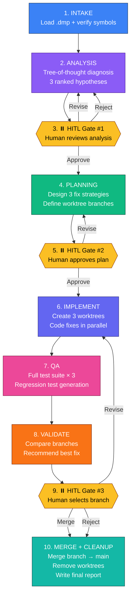
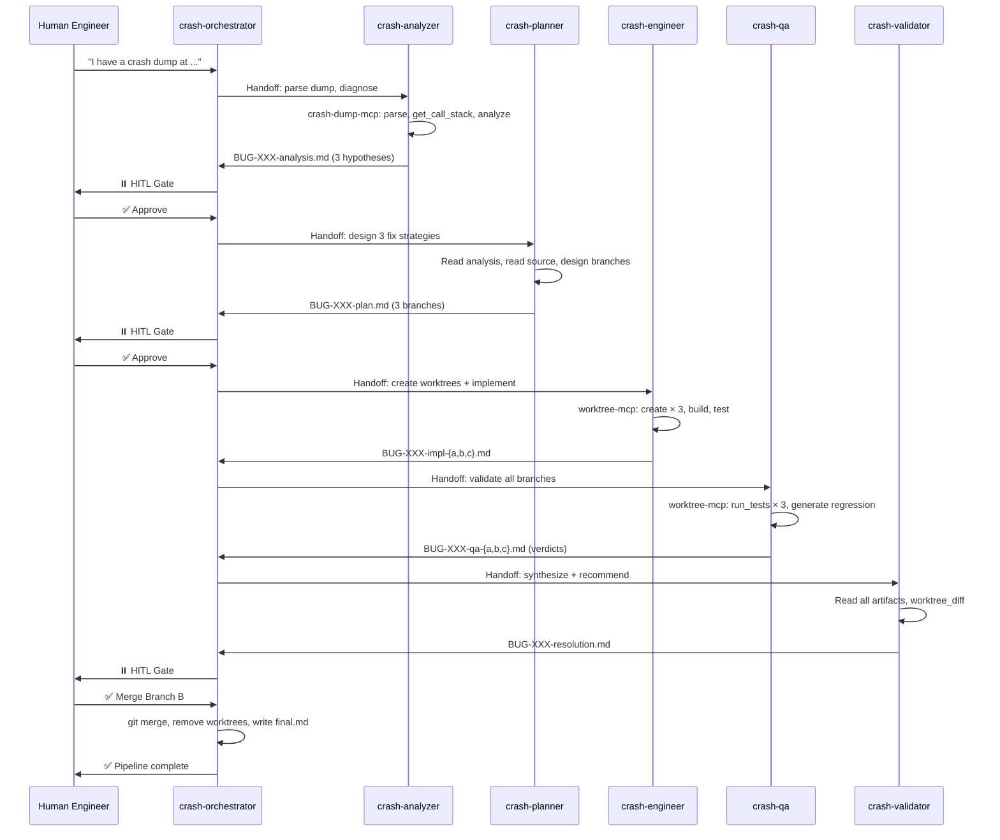
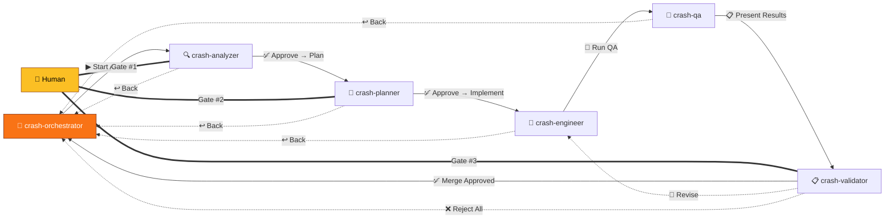
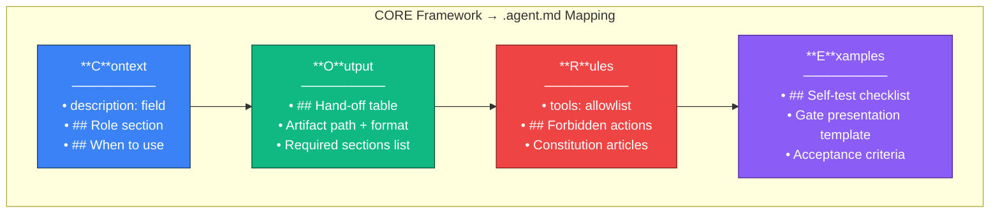
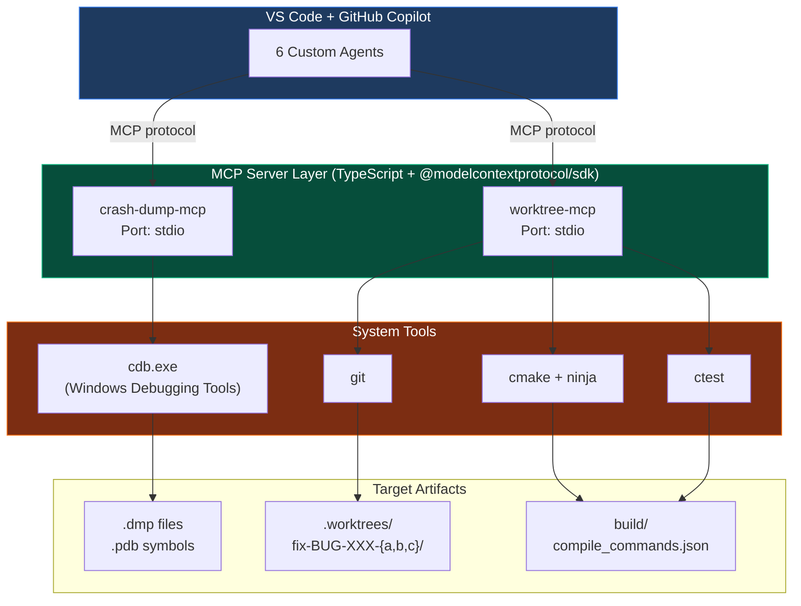
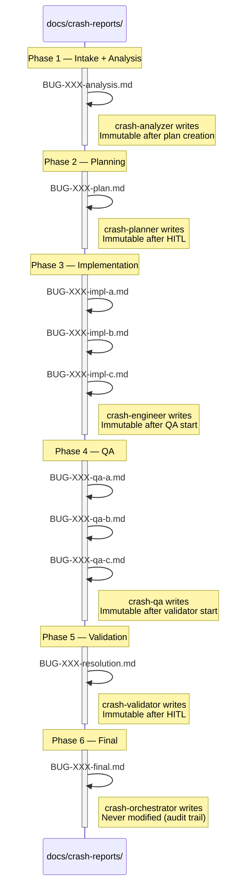
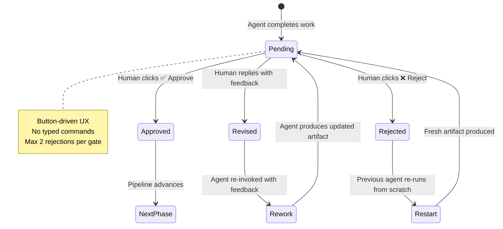
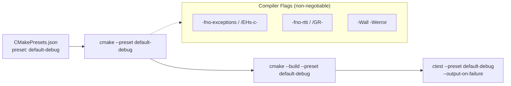

# AI Agent Crash Dump SDLC — Architecture & Design

> **Scope:** This document defines the architecture and design of the AI Agentic Crash Dump
> SDLC — a multi-agent pipeline that transforms a raw `.dmp` crash dump into a tested,
> reviewed, merged fix with full audit trail.

---

## Table of Contents

1. [System Overview](#1-system-overview)
2. [Pipeline Architecture](#2-pipeline-architecture)
3. [Agent Architecture](#3-agent-architecture)
4. [MCP Tool Layer](#4-mcp-tool-layer)
5. [File-Based Handoff Protocol](#5-file-based-handoff-protocol)
6. [Human-in-the-Loop Gates](#6-human-in-the-loop-gates)
7. [Governance Layer](#7-governance-layer)
8. [Infrastructure & Build](#8-infrastructure--build)
9. [BUG-001 Walkthrough](#9-bug-001-walkthrough)

---

## 1. System Overview

### 1.1 What It Does

The AI Agent Crash Dump SDLC is a **fully automated, multi-agent pipeline** that takes a
raw Windows crash dump (`.dmp`) and produces a tested, reviewed, merged fix — orchestrated
by 6 specialized GitHub Copilot custom AI agents with human engineers making critical
decisions at 3 defined gates.

### 1.2 Traditional vs. Agentic Workflow

| Dimension | Traditional (Manual) | Agentic (This SDLC) |
|-----------|---------------------|---------------------|
| **Diagnosis** | Developer opens WinDbg, 30–90 min reading stack frames | crash-analyzer parses dump via MCP, generates 3 ranked hypotheses |
| **Hypotheses** | 1 hypothesis at a time, serial exploration | 3 hypotheses explored in parallel worktrees |
| **Implementation** | Single fix attempt, rewrite if wrong | 3 branches compete; best selected |
| **Validation** | Manual testing, hope it works | Full automated test suite + regression test generation |
| **Audit** | Tribal knowledge, lost context | Full artifact chain with immutable audit trail |
| **Human oversight** | Ad-hoc code review | 3 structured HITL gates at decision points |

### 1.3 Design Principles

| Principle | Description |
|-----------|-------------|
| **Parallel Tree-of-Thought** | 3 worktrees allow simultaneous fix attempts without blocking |
| **HITL at Decision Points** | Humans review analysis, approve plan, and select final branch |
| **Constitution Compliance** | Every fix validated against 8 non-negotiable articles |
| **File-Based Handoff** | Agents communicate via markdown artifacts — no direct calls |
| **Worktree Isolation** | Main tree never modified; branches compete independently |
| **Minimum Viable Fix** | No refactoring, no feature creep — fix the crash, nothing more |
| **Deterministic Reproducibility** | Seeded RNG, regression tests prove fix correctness |
| **Immutable Audit Trail** | Every decision, artifact, and commit recorded for post-incident review |

---

## 2. Pipeline Architecture

### 2.1 End-to-End Pipeline (10 Steps)



### 2.2 Agent-to-Agent Sequence



---

## 3. Agent Architecture

### 3.1 Agent Roles

| Agent | Role | Analogy | Tools | Primary Output |
|-------|------|---------|-------|----------------|
| **crash-orchestrator** | Workflow conductor | Project manager | worktree-mcp, git | `BUG-XXX-final.md` |
| **crash-analyzer** | Diagnostician | Forensic investigator | crash-dump-mcp, read, search | `BUG-XXX-analysis.md` |
| **crash-planner** | Architect | Tech lead | read, search, edit | `BUG-XXX-plan.md` |
| **crash-engineer** | Implementer | Senior developer | worktree-mcp, edit, build, test | `BUG-XXX-impl-{a,b,c}.md` |
| **crash-qa** | Test validator | QA engineer | worktree-mcp, run_tests, edit | `BUG-XXX-qa-{a,b,c}.md` |
| **crash-validator** | Final quality gate | Release manager | worktree-mcp (read-only), GitHub | `BUG-XXX-resolution.md` |

### 3.2 Agent Handoff Topology



### 3.3 Agent Responsibilities & Boundaries

Each agent follows strict separation of concerns:

| Agent | CAN do | CANNOT do |
|-------|--------|-----------|
| **crash-orchestrator** | Invoke agents, verify artifacts, merge, cleanup | Analyze dumps, write code, run tests directly |
| **crash-analyzer** | Parse dumps, read source, write analysis | Modify source, run builds, commit to git |
| **crash-planner** | Read analysis + source, write plan | Modify source, create worktrees, run builds |
| **crash-engineer** | Create worktrees, modify code, build, test | Modify main tree, push to remote, skip compilation |
| **crash-qa** | Run tests, generate regression tests, write verdicts | Modify production source, approve fixes |
| **crash-validator** | Read all artifacts, read diffs, write brief | Merge branches, modify source, approve on behalf of human |

### 3.4 Agent CORE Composition

Every `.agent.md` file is structured using the CORE framework:



| CORE Pillar | Maps to in `.agent.md` | Purpose |
|-------------|------------------------|---------|
| **Context** | `description:` + `## Role` + `## When to use` | What the AI needs to know |
| **Output** | `## Hand-off` table + artifact path/format | What exactly the AI produces |
| **Rules** | `tools:` allowlist + `## Forbidden actions` | What the AI must never do |
| **Examples** | `## Self-test` checklist + gate template | What "good" looks like |

---

## 4. MCP Tool Layer

### 4.1 Architecture Overview



### 4.2 crash-dump-mcp (7 Tools)

Wraps `cdb.exe` (Windows Debugging Tools CLI) to provide structured crash dump analysis.

| Tool | Parameters | Returns | Used By |
|------|-----------|---------|---------|
| `parse_minidump` | `dumpPath`, `pdbPath` | Exception code, faulting thread, module count, process name, timestamp | crash-analyzer |
| `get_call_stack` | `threadId?`, `maxFrames=50` | Array of `StackFrame` (module, function, file, line, displacement) | crash-analyzer |
| `analyze_crash` | — | Exception details, faulting frame, auto-generated hypotheses | crash-analyzer |
| `resolve_symbols` | `address` (hex) | Module, function name, source file, line number | crash-analyzer |
| `get_thread_context` | `threadId` | Register state (rax, rbx, rsp, rip, etc.) | crash-analyzer |
| `list_modules` | — | Module names, base addresses, sizes, PDB match status | crash-analyzer |
| `get_memory_region` | `address`, `size=256` | Hex dump + ASCII representation | crash-analyzer |

**Key constraints:**
- One dump session at a time (shared CDB process)
- Symbol loading verified: >50% modules must resolve PDBs
- All tool handlers wrapped with error handling to prevent agent hangs

### 4.3 worktree-mcp (6 Tools)

Wraps `git`, `cmake`, and `ctest` to provide isolated build/test environments.

| Tool | Parameters | Returns | Used By |
|------|-----------|---------|---------|
| `create_worktree` | `repoPath`, `branchName`, `baseBranch="main"` | Success flag, worktree path, branch name | crash-engineer |
| `list_worktrees` | `repoPath` | Active worktrees with path, branch, commit SHA | crash-orchestrator, crash-engineer |
| `remove_worktree` | `repoPath`, `worktreePath`, `force?` | Success flag, removed path | crash-orchestrator |
| `cmake_build` | `worktreePath`, `preset="dev-msvc"` | Success bool, errors[], warnings[], elapsed time | crash-engineer |
| `run_tests` | `worktreePath`, `preset?`, `filter?` | Pass/fail counts, failed test names[], elapsed time | crash-engineer, crash-qa |
| `worktree_diff` | `worktreePath`, `baseBranch="main"` | Summary (`--stat`) + full diff | crash-validator |

**Key constraints:**
- Timeouts: cmake configure 60s, build 300s, ctest 120s
- Worktree paths follow convention: `.worktrees/fix-<BUG-ID>-{a,b,c}/`
- Returns structured JSON for deterministic parsing by agents

---

## 5. File-Based Handoff Protocol

### 5.1 Design Rationale

Agents never call each other directly. All inter-agent communication flows through
**markdown artifacts** in `docs/crash-reports/`. This provides:

- **Auditability** — every intermediate state is recorded
- **Resumability** — pipeline can restart from any artifact
- **Debuggability** — humans can inspect any handoff point
- **Immutability** — artifacts become read-only once consumed by the next phase

### 5.2 Artifact Production Chain



### 5.3 Naming Convention

```
docs/crash-reports/
├── BUG-XXX-analysis.md       ← crash-analyzer
├── BUG-XXX-plan.md           ← crash-planner
├── BUG-XXX-impl-a.md         ← crash-engineer (branch a)
├── BUG-XXX-impl-b.md         ← crash-engineer (branch b)
├── BUG-XXX-impl-c.md         ← crash-engineer (branch c)
├── BUG-XXX-qa-a.md           ← crash-qa (branch a)
├── BUG-XXX-qa-b.md           ← crash-qa (branch b)
├── BUG-XXX-qa-c.md           ← crash-qa (branch c)
├── BUG-XXX-resolution.md     ← crash-validator
└── BUG-XXX-final.md          ← crash-orchestrator
```

### 5.4 Required Artifact Contents

| Artifact | Required Sections |
|----------|-------------------|
| **analysis.md** | Exception summary, annotated call stack, tree-of-thought (3 hypotheses), evidence, recommended next steps |
| **plan.md** | Summary, branch table (3 rows: name/hypothesis/strategy/files), acceptance criteria, risk assessment, HITL gate |
| **impl-{a,b,c}.md** | Changes summary, build status, test results, Constitution compliance checklist |
| **qa-{a,b,c}.md** | Test matrix, regression test (name + code), regression result, verdict (PASS/FAIL/CONDITIONAL), branch comparison |
| **resolution.md** | Executive summary, branch comparison table, recommended branch, diff preview, regression confirmation, HITL gate |
| **final.md** | Timeline, root cause, fix applied, hypothesis outcomes, lessons learned, cleanup confirmation |

### 5.5 Immutability Rules

| Artifact | Becomes immutable when... |
|----------|---------------------------|
| analysis.md | Plan creation starts |
| plan.md | Human approves at HITL Gate #2 |
| impl-{a,b,c}.md | QA starts on that branch |
| qa-{a,b,c}.md | Validator begins synthesis |
| resolution.md | Human decides at HITL Gate #3 |
| final.md | Never modified (permanent audit trail) |

---

## 6. Human-in-the-Loop Gates

### 6.1 Design Philosophy

HITL gates enforce that **humans make the critical decisions** while AI handles the
mechanical work. Gates are button-driven — no typed commands required. Each gate
presents structured context and exactly the buttons needed to advance.

### 6.2 Gate Architecture



### 6.3 Gate Decision Table

| Gate | Trigger | Agent Presenting | Options | Downstream Effect |
|------|---------|-----------------|---------|-------------------|
| **#1 — Analysis Review** | crash-analyzer completes analysis.md | crash-orchestrator | ✅ Approve → crash-planner | Planning begins |
| | | | 🔄 Revise (reply with feedback) | Re-invoke crash-analyzer |
| | | | ❌ Reject → re-run analysis | Discard, start fresh |
| **#2 — Plan Approval** | crash-planner completes plan.md | crash-orchestrator | ✅ Approve → crash-engineer | Worktree creation + implementation |
| | | | 🔄 Revise (reply with feedback) | Re-invoke crash-planner |
| | | | ❌ Reject | Pipeline halted |
| **#3 — Branch Selection** | crash-validator completes resolution.md | crash-validator | ✅ Merge `<branch>` → orchestrator | Merge + cleanup |
| | | | 🔄 Revise → crash-engineer | Iterate on implementation |
| | | | ❌ Reject All → orchestrator | Abandon, cleanup worktrees |

### 6.4 Gate Presentation Format

Every gate uses this canonical structure:

```markdown
### ⏸️ HUMAN IN THE LOOP — HITL Gate #N: <Title>

**Context**: <What just completed, where the artifact lives>
**Objective**: <What decision the human needs to make>
**Requirements**: <What to review before deciding>
**Expectations**: Use the buttons below — no typing required.

▶ ✅ **Approve** — click [button name] to advance
▶ 🔄 **Revise** — reply in chat with feedback
▶ ❌ **Reject** — click [button name] to discard/halt
```

### 6.5 Error Routing at Gates

| Error Scenario | Action | Max Retries | Escalation |
|----------------|--------|-------------|------------|
| crash-analyzer fails | Retry crash-analyzer | 2 | Surface error at Gate #1 |
| crash-planner fails | Retry crash-planner | 2 | Surface error at Gate #2 |
| crash-engineer fails (1 branch) | Re-invoke for failing branch | 1 | Proceed with passing branches |
| crash-qa fails | Re-invoke crash-qa | 1 | Special HITL gate before validator |
| Zero branches pass QA | Re-invoke crash-engineer for all | 1 | Halt + present failure report |
| 3rd rejection at same gate | Halt pipeline | — | Present summary of blockers |

---

## 7. Governance Layer

### 7.1 Constitution (8 Non-Negotiable Articles)

The constitution at `specs/constitution.md` is **ground truth**. Every fix must comply.

| Article | Rule | Enforcement |
|---------|------|-------------|
| **1** | **No exceptions** — `-fno-exceptions`; use `eastl::expected<T, status>` or status enums | Compiler flag + clang-tidy |
| **2** | **No RTTI** — `-fno-rtti`; no `dynamic_cast`, no `typeid` | Compiler flag + clang-tidy |
| **3** | **EASTL-first** — `eastl::vector`, `eastl::string`, `eastl::unique_ptr`; no `std::` containers | clang-tidy custom check |
| **4** | **Allocator-aware** — every container takes explicit allocator | Code review + agent checklist |
| **5** | **Determinism** — seeded `eastl::mt19937`; `double` accumulators; no pointer-based hash in sim | Agent self-test |
| **6** | **Real-time budgets** — ≤16.67ms @ 60fps; no allocation in inner loops | Profile + arena patterns |
| **7** | **Test-first** — every public function has GTest (happy + edge cases) | CI gate |
| **8** | **HITL gates** — no automation bypass; approval required before merge | Orchestrator enforcement |

### 7.2 CORE Framework

CORE is the four-pillar methodology used to structure every customization file:

| Pillar | Definition | Question It Answers |
|--------|-----------|---------------------|
| **C** — Context | Background knowledge, role, domain constraints | "What does the AI need to know?" |
| **O** — Output | Expected artifact format, location, structure | "What exactly should the AI produce?" |
| **R** — Rules | Constraints, forbidden actions, non-negotiables | "What must the AI never do?" |
| **E** — Examples | Exemplar outputs, self-test criteria, templates | "What does 'good' look like?" |

**CORE applied to each file type:**

| File Type | Context | Output | Rules | Examples |
|-----------|---------|--------|-------|----------|
| `.agent.md` | `## Role` + `description:` | `## Hand-off` (artifact path) | `tools:` allowlist + `## Forbidden` | `## Self-test` checklist |
| `.instructions.md` | `description:` + `applyTo:` | (implicit — shapes output) | The rules themselves | Reference tables, templates |
| `.prompt.md` | `## Context` + `#file:` links | `## Output contract` | `## Pre-conditions` | `## Self-validation` |
| `constitution.md` | (implicit — IS context) | (shapes all outputs) | Articles 1–8 | Violation examples |

### 7.3 Instruction Files (Scoped Rules)

Instruction files activate automatically when Copilot operates on matching files:

| File | `applyTo` Pattern | Governs |
|------|-------------------|---------|
| `cpp-snippets.instructions.md` | `**/*.{h,hpp,cpp,cc,cxx,inl}, **/*.md` | C++20 engine conventions: EASTL, no exceptions/RTTI, allocator-aware, `[[nodiscard]]`, `noexcept` moves |
| `crash-dump-analysis.instructions.md` | `docs/crash-reports/**-analysis.md` | Analysis protocol: MCP tool sequence, 3-hypothesis diversity, evidence standards, exception code mapping |
| `crash-fix-engineering.instructions.md` | `docs/crash-reports/**-impl-*.md` | Worktree workflow: isolated dev, MVF principle, Constitution compliance, build/test validation |
| `resolution-tracking.instructions.md` | `docs/crash-reports/**` | Artifact lifecycle: naming convention, HITL gate format, immutability milestones, audit trail |

### 7.4 Prompt Files (7 Reusable Templates)

| Prompt | Agent | Purpose |
|--------|-------|---------|
| `crash-dump-intake.prompt.md` | crash-analyzer | Entry protocol: load dump, verify symbols, run structured analysis |
| `tree-of-thought-analysis.prompt.md` | crash-analyzer | Generate 3 diverse hypotheses (obvious, systemic, environmental) |
| `regression-test-generation.prompt.md` | crash-qa | GTest template: fails pre-fix, passes post-fix |
| `fix-validation.prompt.md` | crash-validator | Scoring: correctness(40%), test health(30%), minimal change(20%), compliance(10%) |
| `resolution-brief.prompt.md` | crash-validator | Concise branch recommendation for HITL Gate #3 |
| `resolution-report.prompt.md` | crash-orchestrator | Final audit trail: timeline, outcomes, lessons learned |
| `plan-crashDumpSdlcValidation.prompt.md` | (meta) | 10-step demo validation walkthrough |

---

## 8. Infrastructure & Build

### 8.1 Project Structure

```
crash-dump-sdlc-workshop/
├── .github/
│   ├── copilot-instructions.md          ← Workspace-wide Copilot rules
│   ├── agents/                          ← 6 custom AI agent definitions
│   │   ├── crash-analyzer.agent.md
│   │   ├── crash-planner.agent.md
│   │   ├── crash-engineer.agent.md
│   │   ├── crash-qa.agent.md
│   │   ├── crash-validator.agent.md
│   │   └── crash-orchestrator.agent.md
│   ├── instructions/                    ← 4 scoped instruction files
│   │   ├── cpp-snippets.instructions.md
│   │   ├── crash-dump-analysis.instructions.md
│   │   ├── crash-fix-engineering.instructions.md
│   │   └── resolution-tracking.instructions.md
│   └── prompts/                         ← 7 reusable prompt templates
├── specs/
│   └── constitution.md                  ← 8 non-negotiable articles (ground truth)
├── tools/
│   ├── crash-dump-mcp/                  ← MCP server: cdb.exe wrapper (7 tools)
│   └── worktree-mcp/                    ← MCP server: git/cmake/ctest wrapper (6 tools)
├── docs/
│   ├── crash-reports/                   ← Artifact output directory
│   ├── crash-dump-sdlc-runbook.md       ← Operational runbook (10-step)
│   └── agentic-architecture.md          ← Architecture overview
├── include/engine_demo/                 ← C++ headers (allocator, ECS, physics, sim)
├── src/engine_demo/                     ← C++ source (implementation)
├── tests/engine_demo/                   ← GTest test suite
├── fixtures/
│   ├── seeded-bugs.md                   ← 6 intentional defects (demo material)
│   ├── crash_dumps/BUG-001/             ← .dmp + .pdb + repro.cpp
│   └── bug-reports/                     ← Bug tracker documents
├── AGENTS.md                            ← Repository-level agent hard rules
├── CMakeLists.txt                       ← Top-level build
└── CMakePresets.json                    ← Build presets (default-debug)
```

### 8.2 Build System



**Build commands:**

```bash
cmake --preset default-debug
cmake --build --preset default-debug
ctest --preset default-debug --output-on-failure
```

### 8.3 Prerequisites

| Tool | Version | Purpose |
|------|---------|---------|
| Windows Debugging Tools | Latest SDK | `cdb.exe` for dump parsing |
| Node.js | 20+ | MCP server runtime |
| CMake | 3.28+ | Build system generator |
| Ninja | Latest | Build backend |
| Git | 2.40+ | Worktree management |
| VS Code | Latest | IDE + Copilot host |
| GitHub Copilot | Business/Enterprise | AI agent runtime |
| EASTL | Pinned (`third_party/EASTL.commit`) | Container library |

### 8.4 MCP Server Configuration

Both MCP servers are registered in `.vscode/mcp.json` and auto-start when VS Code opens:

```
tools/crash-dump-mcp/   → npm install && npm run build → dist/index.js (stdio)
tools/worktree-mcp/     → npm install && npm run build → dist/index.js (stdio)
```

Environment variable `CDB_PATH` must point to `cdb.exe` installation.

---

## 9. BUG-001 Walkthrough

A concrete trace of the pipeline processing **BUG-001** (heap corruption in arena allocator):

### The Bug

The arena allocator's bounds check runs _after_ `m_offset` advances, so alignment padding
can push allocation past the buffer tail. The third 40-byte allocation at 32-byte alignment
triggers ACCESS_VIOLATION (`0xC0000005`).

### Pipeline Execution

| Step | Agent | Action | Artifact Produced |
|------|-------|--------|-------------------|
| 1. Intake | crash-analyzer | `parse_minidump` → exception 0xC0000005, thread 0 | — |
| 2. Analysis | crash-analyzer | `get_call_stack` → frame at `allocator::allocate` line 42 | `BUG-001-analysis.md` |
| | | Tree-of-thought: A=bounds ordering (high), B=align_up bug (medium), C=capacity (low) | |
| 3. Gate #1 | human | ✅ Approve — Hypothesis A is correct | — |
| 4. Planning | crash-planner | Design 3 branches: a=bounds-check, b=ordering-fix, c=type-fix | `BUG-001-plan.md` |
| 5. Gate #2 | human | ✅ Approve — all 3 approaches reasonable | — |
| 6. Implement | crash-engineer | `create_worktree` × 3, code fixes, `cmake_build` × 3 | `BUG-001-impl-{a,b,c}.md` |
| 7. QA | crash-qa | `run_tests` × 3, enable DISABLED test, verify regression | `BUG-001-qa-{a,b,c}.md` |
| 8. Validate | crash-validator | Score: A=92, B=95, C=68 → recommend B | `BUG-001-resolution.md` |
| 9. Gate #3 | human | ✅ Merge Branch B — cleanest expression of intent | — |
| 10. Merge | crash-orchestrator | `git merge fix/BUG-001-b`, cleanup × 3 | `BUG-001-final.md` |

### Branch Comparison (Step 8)

| Criteria (weight) | Branch A (bounds-check) | Branch B (ordering-fix) | Branch C (type-fix) |
|-------------------|------------------------|------------------------|---------------------|
| Correctness (40%) | ✅ Passes | ✅ Passes | ⚠️ Masks bug |
| Test health (30%) | 100% pass | 100% pass | 100% pass |
| Minimal change (20%) | 3 lines | 5 lines | 1 line |
| Constitution (10%) | ✅ Full | ✅ Full | ✅ Full |
| **Score** | **92** | **95** | **68** |

### Fix Applied (Branch B)

```
// BEFORE: offset advances, THEN bounds check
m_offset = align_up(m_offset, alignment);   // ← advances past tail!
if (m_offset + n > m_capacity) return nullptr;

// AFTER: compute in locals, validate, THEN commit
const auto aligned = align_up(m_offset, alignment);
if (aligned + n > m_capacity) return nullptr;
m_offset = aligned;
```

---

## Appendix: Diagram Legend

| Symbol | Meaning |
|--------|---------|
| Rectangle | Process / phase |
| Diamond `{{ }}` | HITL gate (human decision) |
| Solid arrow `→` | Forward flow (happy path) |
| Dashed arrow `-.->` | Return / error path |
| Double line `===` | Human interaction |
| 🔵 Blue | Intake |
| 🟡 Yellow | HITL gate |
| 🟢 Green | Planning |
| 🟣 Purple | Implementation |
| 🔴 Pink | QA/Testing |
| 🟠 Orange | Orchestration/Validation |
